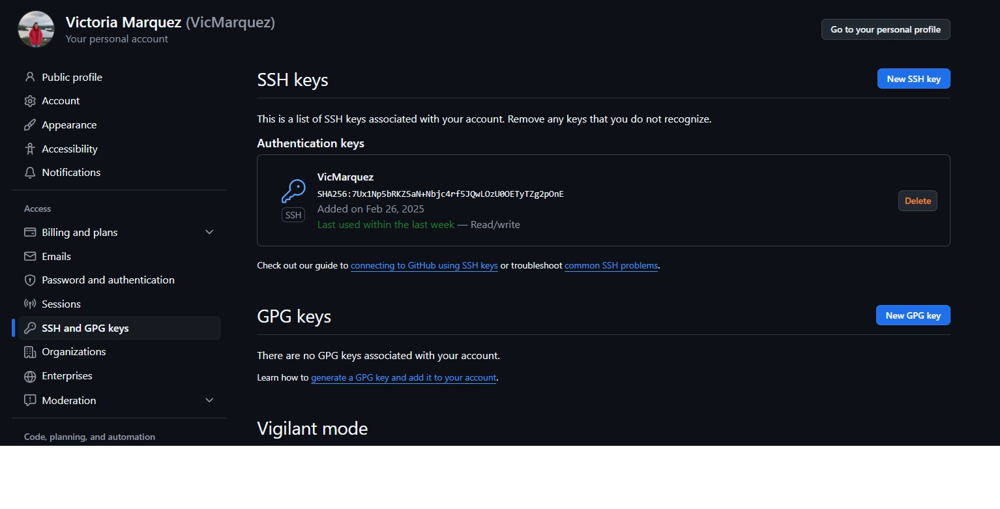

# Comandos principales


### **git pull**
Sincroniza el repositorio local con las actualizaciones del repositorio remoto en GitHub, incorporando los cambios realizados por el equipo.

### **git status**
Muestra el estado actual del repositorio: cambios locales, rama activa y otros detalles relevantes.

### **git add + git commit + git push**
Estos comandos permiten cargar cambios locales al repositorio:

- **git add**: Agrega archivos modificados o nuevos al área de preparación (*staging area*).
- **git commit -m "Mensaje descriptivo"**: Guarda los cambios en el historial de versiones con un mensaje explicativo.
- **git push**: Envía los cambios confirmados al repositorio remoto en GitHub.

---

# Configuración de GitHub

Para comenzar a usar GitHub:
1. Crear una cuenta y verificar el correo: [Guía de inicio](https://docs.github.com/en/get-started/onboarding/getting-started-with-your-github-account).
2. Instalar Git en nuestra computadora.
3. Generar un **token de acceso personal** (PAT), necesario para autenticar nuestra identidad al interactuar con GitHub desde un dispositivo local: [Instrucciones](https://docs.github.com/en/authentication/keeping-your-account-and-data-secure/managing-your-personal-access-tokens).
4. Configurar Git con nuestro usuario y correo:
   ```bash
   git config --global user.name "Tu Nombre"
   git config --global user.email "tu-email@ejemplo.com"
   ```
---

# ¡Usando claves SSH!



Para evitar tener que ingresar usuario y contraseña cada vez que interactuamos con GitHub, podemos configurar una **clave SSH**.

### **Generar una clave SSH**
Ejecutar en la terminal:
```bash
ssh-keygen -t ed25519 -C "tu-email@ejemplo.com"
```
O, si es necesario usar RSA:
```bash
ssh-keygen -t rsa -b 4096 -C "tu-email@ejemplo.com"
```
Al ejecutar el comando:
- Pedirá elegir una ubicación para guardar la clave. Presionar *Enter* para aceptar la ubicación por defecto (~/.ssh/id_ed25519).
- Puede solicitar una contraseña opcional (puede dejarse vacía o agregar por seguridad).

### **Agregar la clave SSH a GitHub**
1. Ir a **Settings** > **SSH and GPG keys**.
2. Clic en **New SSH key**.
3. Poner un nombre descriptivo (ej. "Mi PC RStudio").
4. Pegar la clave copiada en el campo "Key".
5. Hacer clic en **Add SSH key**.

Ahora, GitHub ya reconocerá tu dispositivo sin necesidad de ingresar credenciales cada vez que uses Git.

### **Uso de Github en Ecología**

Investigación más reproducible y colaborativa! 

Ejemplos de como Github puede contribuir a las invetigaciones en Ecología:

1. Storing and sharing research compendia.

An research compendium includes all computational materials related to research production, including data, code for analyses and protocols

GitHub allows administrative control over who can view and modify repositories, and the process of
cloning, forking and suggesting changes through pull requests ensures code owners have full control over code and documents.

2. Proyect continuity

Research code and data management upkeep tends to fall off as researchers move on to new
projects or other institutions. Also, code and data can be difficult to access and recover when kept only on personal devices

3. Peer review

GitHub provides an open and transparent platform that can be used for either directly providing feedback on research products or addressing changes recommended by reviewers. GitHub Issues
can be used to organize and discuss reviewer suggestions and to assign them to co-authors
(https://github.com/SORTEE-Github-Hackathon/manuscript/issues?q=label%3A%22Reviewer+Comment%22).


4. Collaborative and asynchronous code editing

Version control allows researchers to make changes in code or documents without worrying about irreparably modifying someone else's work.

users can clone, allowing for modifications to be done on a linked copy of a repository, which can then later be merged into the main project through pull requests


[Braga et al. 2022.](DOI: 10.1111/2041-210X.14108)

